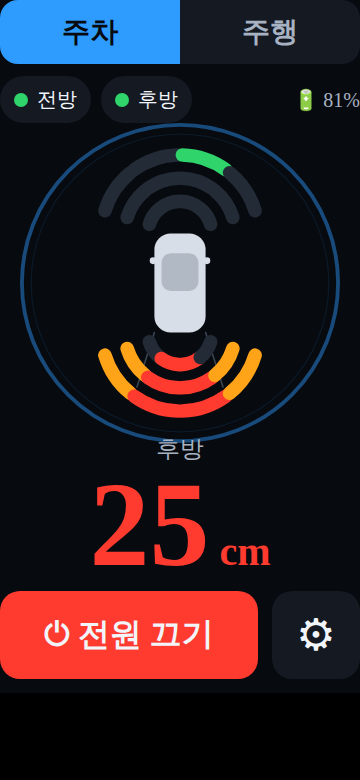
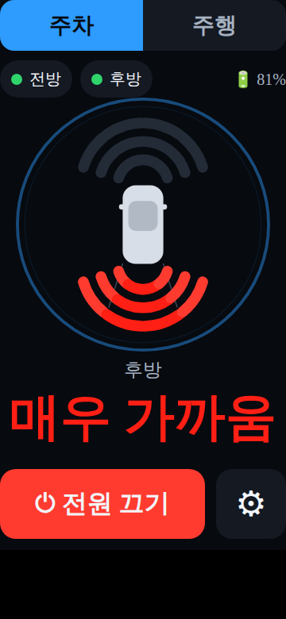
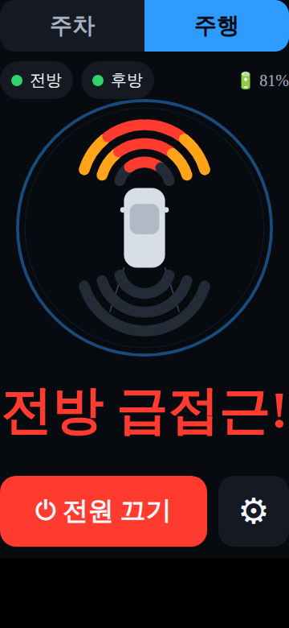
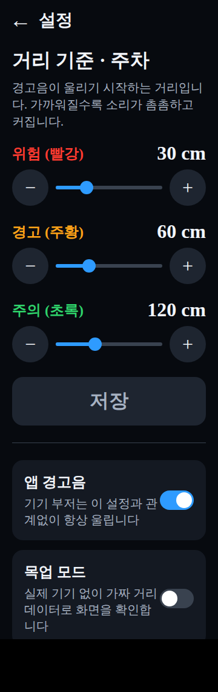
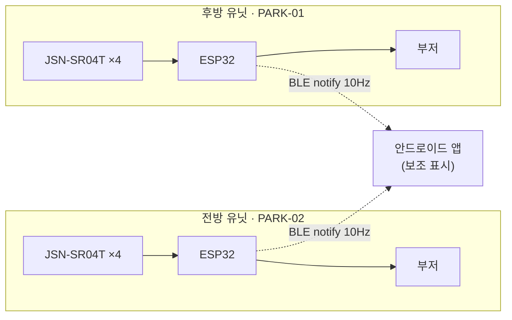

# park-assist

**자동차 앞뒤 번호판에 집게로 물리는 초음파 주차·주행 보조 센서.**

ESP32 유닛 두 대가 앞뒤 범퍼에서 각각 4방향 거리를 재고, 가까워질수록 세지는 경고음을
자체 부저로 울린다. 안드로이드 앱은 BLE로 두 유닛에 동시에 붙어 방향과 거리를 보여준다.

> **앱은 없어도 된다.** 부저 경보는 폰·BLE와 무관하게 기기 단독으로 완결된다.
> 앱이 죽어도, 폰이 차에 없어도 경보는 울린다 ([ADR 0001](docs/decisions/0001-buzzer-direct-drive.md)).

---

## 화면

<table>
<tr>
<td width="33%"></td>
<td width="33%"></td>
<td width="33%"></td>
</tr>
<tr>
<td><b>주차 — 후방 접근</b><br>차량 위아래 부채꼴이 센서 8개다. 가까워질수록 바깥쪽부터
안쪽으로 차오르며 회색→초록→주황→빨강. 가장 가까운 거리를 큼직하게 띄운다.</td>
<td><b>사각지대</b><br>25cm 안쪽은 센서가 못 읽어 값이 사라진다. 그때 화면을 비우지 않고
<b>"매우 가까움"</b>으로 바꾸고 부채꼴을 깜빡인다.</td>
<td><b>주행 — 급접근</b><br>거리가 아니라 <b>접근 속도</b>로 판정한다. 앞차가 훅 들어올 때만
울리고, 티맵 안내 음성 위로 들리게 오디오 포커스를 잠깐 가져간다.</td>
</tr>
</table>



### 설정

- **거리 기준 3단계**를 슬라이더로 조정한다. 60대 사용자를 고려해 큼직한 −/+ 버튼을 같이 뒀다
- 기준값은 **주차/주행 모드별로 따로** 저장된다. 저장하면 `0xBB` 명령으로 두 유닛에 전달된다
- **앱 경고음** 토글은 앱 소리만 끈다. 기기 부저는 이 설정과 무관하게 항상 울린다
- **목업 모드**를 켜면 실제 기기 없이 전 화면이 동작한다 (아래 참조)

<br clear="right">

> 위 이미지는 실기기 스크린샷이 아니라 **`CarRadar.kt`·`Color.kt`의 실제 상수를 읽어
> 재현한 목업**이다. Compose Canvas와 SVG의 좌표계·각도 기준이 같아 기하는 1:1로 일치하지만,
> 글꼴과 안티앨리어싱은 실제 안드로이드 렌더링과 다르다.
> 생성 스크립트는 [`tools/render-screens.py`](tools/render-screens.py)에 있다.

---

## 두 가지 모드

주차용 규칙을 주행에 그대로 쓰면 **정체 구간에서 쉬지 않고 울린다.** 앞뒤 차가 1~2m에
있는 건 주행 중 정상 상태이기 때문이다. 그래서 판정 기준 자체를 나눴다.

| | 주차 | 주행 |
| --- | --- | --- |
| 경보 기준 | **거리** | **접근 속도** (최근 0.6초, 60cm/s 이상) |
| 소리 | 가까울수록 촘촘·크게·높게 (연속 곡선) | 급접근일 때만, 처음부터 최대 강도 |
| 기기 기준값 기본 | 30 / 60 / 120 cm | 20 / 35 / 50 cm |
| 오디오 | 일반 재생 | 내비 음성을 잠깐 줄이고 그 위로 |

> ⚠️ **주행 감지에는 물리적 한계가 있다.** 초음파 센서 측정 한계가 약 250cm, 갱신이 10Hz라
> 상대속도 30km/h면 감지 구간을 지나는 동안 프레임이 3장뿐이다.
> **정체 구간·주차장·저속 시내 주행용이고, 고속 추돌 경보로는 쓸 수 없다.**

## 경고음이 거리에 따라 세진다

단계가 3개뿐이면 기준선을 넘는 순간에만 소리가 바뀌어서, 그 사이에서 얼마나 가까워지고
있는지 알 수 없다. 그래서 거리 기준 3개를 **경계선**으로만 쓰고 그 사이를 연속 보간한다.

| 거리 | 강도 | 울림 간격 | 앱 음량 | 앱 음높이 |
| --- | --- | --- | --- | --- |
| `far` (120cm) 이상 | 0 | 무음 | — | — |
| `far` 바로 안쪽 | 0+ | 1000ms | 35% | ×1.00 |
| `mid` (60cm) | 0.34 | 424ms | 57% | ×1.15 |
| `near` (30cm) | 0.67 | 184ms | 79% | ×1.30 |
| 0cm | 1.0 | 80ms → **연속음** | 100% | ×1.45 |

간격은 등비 보간(`1000 × 0.08^강도`)이라 귀에 고르게 들린다. 강도 0.93을 넘으면 끊지 않는다.

기기 부저(액티브 부저 HW-508)는 음색을 못 바꿔서 **울림 간격**으로만 표현하고, 앱이 음량과
음높이를 더 얹는다. **같은 곡선을 펌웨어와 앱이 각각 구현**하므로 한쪽을 바꾸면 다른 쪽도
같은 PR에서 고쳐야 한다 ([`docs/ble-protocol.md`](docs/ble-protocol.md) 6절).

---

## 시스템 구성



**범퍼마다 독립된 유닛**을 둔다. 한 보드로 8개를 묶으면 방수 케이블을 차 안으로 관통시켜야
하고, 순차 발사 때문에 갱신 주기가 10Hz에서 5Hz로 반토막 난다
([ADR 0004](docs/decisions/0004-two-device-split.md)).

| 유닛 | 광고 이름 | 센서 |
| --- | --- | --- |
| 후방 | `PARK-01` | 4 |
| 전방 | `PARK-02` | 4 |

펌웨어는 **한 벌**이고 `ZONE_IS_REAR` 매크로만 바꿔 굽는다. 두 유닛은 서비스 UUID가 같고
광고 이름만 달라서, 앱은 **연결 전에 이름을 반드시 확인**한다. 한쪽이 꺼져도 다른 쪽은
그대로 동작한다.

---

## 하드웨어

| 구분 | 부품 | 수량 |
| --- | --- | --- |
| MCU | ESP32 DevKitC 30핀 | 2 |
| 거리 센서 | JSN-SR04T 방수 초음파 모듈 | 8 |
| 경보 | 액티브 부저 HW-508 | 2 |
| 전원 | 미정 (차량 12V 벅 컨버터 / 18650 + TP4056) | 2 |
| 기구 | 집게형 마운트 | 2 |

### 핀맵 (유닛 공통)

| 채널 | Trig | Echo |
| --- | --- | --- |
| CH1 (왼쪽 끝) | GPIO 13 | GPIO 34 |
| CH2 | GPIO 25 | GPIO 35 |
| CH3 | GPIO 26 | GPIO 36 (VP) |
| CH4 (오른쪽 끝) | GPIO 27 | GPIO 39 (VN) |
| 부저 | GPIO 4 | — |

배선 주의사항(Echo 5V 레벨, 입력 전용 핀, 부저 구동 전류, 25cm 사각지대)은
[`docs/hardware.md`](docs/hardware.md)에 정리되어 있다. **조립 전에 반드시 읽을 것.**

---

## 빌드

### 펌웨어

```bash
# 최초 1회 — ESP32 보드 지원 설치
arduino-cli core update-index --additional-urls \
  https://raw.githubusercontent.com/espressif/arduino-esp32/gh-pages/package_esp32_index.json
arduino-cli core install esp32:esp32

arduino-cli compile --fqbn esp32:esp32:esp32 firmware/park-assist-fw
arduino-cli upload  --fqbn esp32:esp32:esp32 -p /dev/ttyUSB0 firmware/park-assist-fw
```

보드: **ESP32 Dev Module**. 전방 유닛을 구울 때는 `.ino` 상단의 `ZONE_IS_REAR`를 `0`으로 바꾼다.

> 플래시가 이미 **84%** 찼다(BLE 스택이 무겁다). 기능을 더 얹기 전에
> [`firmware/park-assist-fw/README.md`](firmware/park-assist-fw/README.md)의 파티션 스킴 항목을 볼 것.

### 안드로이드 앱

```bash
cd android/ParkAssist
./gradlew assembleDebug        # 디버그 APK
./gradlew installDebug         # 연결된 기기에 설치
./gradlew testDebugUnitTest    # 단위 테스트 47개
```

**실기기가 없어도 된다.** 설정에서 **목업 모드**를 켜면 전방·후방 양쪽에 가짜 데이터가
흐르고, 한 주기 안에 이런 상황이 다 재현된다.

- 후방: 물체 접근 → 근접 유지 → 후퇴 (26초 주기)
- 후방: 25cm 진입 시 `0xFF` → "매우 가까움" + 최고 경보
- 후방 CH2: 주기적 측정 실패 (고장 센서 표시)
- 전방: 9초마다 200cm → 50cm 급접근 (주행 경보 검증)
- 버튼으로 연결 끊김 → 지수 백오프 재연결

### CI

PR마다 [`.github/workflows/ci.yml`](.github/workflows/ci.yml)이 **앱 빌드·테스트와 펌웨어
컴파일을 함께** 돌린다. 둘은 BLE 규격으로만 붙어 있어서 한쪽만 고치면 조용히 어긋난다.

---

## BLE 규격

Nordic UART 계열 UUID를 쓰는 고정 길이 바이너리 패킷. 전체 규격은
[`docs/ble-protocol.md`](docs/ble-protocol.md).

| 방향 | 패킷 | 용도 |
| --- | --- | --- |
| 기기 → 폰 | `[0xAA][d1][d2][d3][d4][XOR]` | 4채널 거리 (cm), 10Hz |
| 폰 → 기기 | `[0xBB][near][mid][far][XOR]` | 경보 거리 기준 변경 |
| 폰 → 기기 | `[0xCC][0x00\|0x01][XOR]` | 전원 대기 / 작동 |

**`0xFF`는 255cm가 아니라 측정 실패다.** 이걸 유효 거리로 취급하면 가장 위험한 순간에
경보가 사라지므로, 앱은 `Distance` 값 클래스로 타입 수준에서 막는다.

---

## 개발

작업 규칙과 자주 쓰는 명령은 [`CLAUDE.md`](CLAUDE.md), 설계 결정은
[`docs/decisions/`](docs/decisions/)에 있다.

핵심 원칙 네 가지:

1. **부저는 ESP32 직결** — 폰/BLE 없이도 작동한다 (안전 최우선)
2. **센서는 순차 발사** — 동시 발사 시 상호간섭으로 값이 오염된다
3. **`loop()`에서 `delay()` 금지** — `millis()` 기반 논블로킹
4. **앱은 보조 표시 장치** — 주 경고 채널이 아니다

## 상태

| 영역 | 상태 |
| --- | --- |
| BLE 규격 | 확정 (명령 ACK·설정값 조회는 미정) |
| 펌웨어 | 구현 완료 — 측정·경보·BLE·NVS |
| 안드로이드 앱 | 구현 완료 — 화면 2개, 목업 모드 포함 |
| 하드웨어 | 부품 확정, **전원 방식 미정** |

CI에서 앱 빌드·단위 테스트 47개·펌웨어 컴파일이 모두 통과한다.
다만 **실기기 검증은 아직 하지 않았다** — 실제 센서·부저·BLE 연결로 확인한 적이 없다.

남은 일:

- **전원 방식 결정** — 정해져야 표준 Battery Service(`0x180F`)를 붙인다. 지금은 앱이
  배터리를 "알 수 없음(`--`)"으로 두고 나머지는 정상 동작한다
- **채널 좌우 순서 실측** — `d1`이 왼쪽 끝인지 앞뒤 유닛 각각 확인
- **명령 ACK / 설정값 조회** — 현재는 앱에 저장된 값을 진실로 보고 연결 때마다 밀어 넣는다
